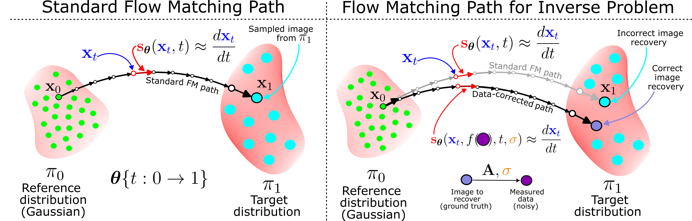

# AttEn-DAWN-FM: Attention-Enhanced Data-Aware and Noise-Informed Flow Matching for Solving Inverse Problems

This repository contains the implementation of AttEn-DAWN-FM, a self-attention-enhanced extension of DAWN-FM for solving ill-posed inverse problems using flow matching. We build upon the FM framework with architectural and data-conditioning improvements, and apply our model for deblurring (on MNIST dataset) and tomography (on OrganCMNIST dataset) tasks.

If you use this code, please cite:

> S. Ahamed and E. Haber, _"DAWN-FM: Data-Aware and Noise-Informed Flow Matching for Solving Inverse Problems"_, arXiv:2412.04766, 2025.

<p align="center">

</p>
<p align="justify">
    Schematics for standard flow matching (left) and flow matching for solving inverse problem characterized by the forward problem $\mathbf{A}$ along with an additive noise scale $\sigma$ (right). Here, $\mathbf{s}_\boldsymbol{\theta}$ represents the trained network for estimating the velocity along the trajectory $\mathbf{x}_t$ at time $t$ between the reference distribution $\pi_0$ and the target distribution $\pi_1$, and $f$ represents a transformation on the measured (noisy) data which is used as data-embedding into the flow-matching network on the right.
</p>


## Getting Started

### 1. Clone the repository
```bash
git clone https://github.com/ahxmeds/AttEn-DAWN-FM.git
cd AttEn-DAWN-FM
```

### 2.  Set up the conda environment
```bash
conda env create -f environment.yml
```

### 3.  Train the model
```bash
python train.py --dataset <dataset> --data-emb <data-emb> --batch-size <batch-size> --workers <workers> --device <cuda-device-index> --max-epochs <max-epochs> --save-every <save-every> --max-noise <max-noise>
```
where, `<dataset>` can be MNIST or OrganCMNIST, `<data-emb>` can be either `atb` (for `f(b) = A^Tb`) or `cgls` (`f(b) = Conjugate-Gradient-Least-Squares(A, b)`), `<batch-size>` is the training batch size, `<workers>` denote the number of workers, `<cuda-device-id>` could be device id for the CUDA device or `'cpu'`, `<save-every>` defined how often you want to save the model weights during training with respect to epochs, and `<max-noise>` refers to the maximum percent noise added to the measured data.

### 4.  Inference on the test set
```bash
python inference.py --dataset <dataset> --data-emb <data-emb> --ckpt <ckpt> --batch-size <batch-size> --workers <workers> --device <cuda-device-index> --noise-level <noise-level> --nsteps <nsteps> --num-runs <num-runs>
```
where, `<dataset>` can be MNIST or OrganCMNIST, `<data-emb>` can be either `atb` (for `f(b) = A^Tb`) or `cgls` (`f(b) = Conjugate-Gradient-Least-Squares(A, b)`), `<ckpt>` refers to the model weights to load from a specific training epoch (defaults to the last saved checkpoint if None), `<batch-size>` is the training batch size, `<workers>` denote the number of workers, `<cuda-device-id>` could be device id for the CUDA device or `'cpu'`, `<noise-level>` refers to the percent noise added to the measured data, and `<nteps>` refers to the number of RK4 integration steps for solving the ODE, and `<num-runs>` number of independent generation runs for each input. 

### 5.  Compute metrics on the test set
```bash
python compute_metrics.py --dataset <dataset> --data-emb <data-emb> --device <cuda-device-index> --num-runs <num-runs>
```
where, `<dataset>` can be MNIST or OrganCMNIST, `<data-emb>` can be either `atb` (for `f(b) = A^Tb`) or `cgls` (`f(b) = Conjugate-Gradient-Least-Squares(A, b)`), `<cuda-device-id>` could be device id for the CUDA device or `'cpu'`, `<num-runs>` number of independent generation runs for each input (as specified during inference). 

## References
[1] S. Ahamed and E. Haber, _"DAWN-FM: Data-Aware and Noise-Informed Flow Matching for Solving Inverse Problems"_, arXiv:2412.04766, 2025.

[2] P. C. Hansen, _"Rank-Deficient and Discrete Ill-Posed Problems"_. SIAM, Philadelphia, 1997.

[3] Jiancheng Yang, Rui Shi, Donglai Wei, Zequan Liu, Lin Zhao, Bilian Ke, Hanspeter Pfister, and Bingbing Ni. _"Medmnist v2-a large-scale lightweight benchmark for 2d and 3d biomedical image classification"_. Scientific Data, 10(1):41, 2023.
